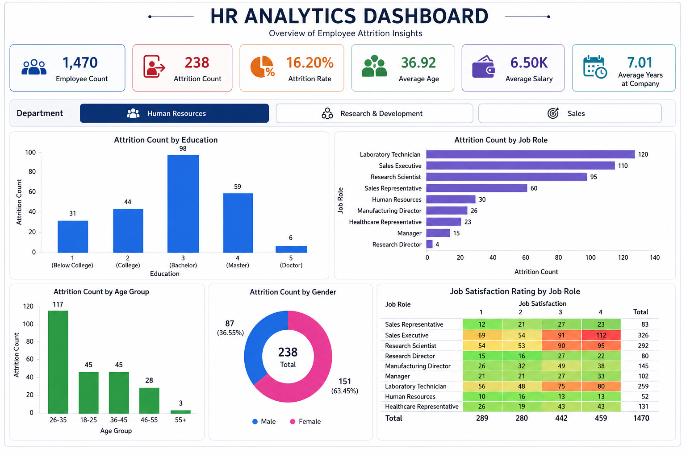

# HR Analytics Dashboard (Power BI)

## Dashboard Preview

## Overview
This project presents an interactive HR Analytics Dashboard built in Power BI to analyze employee attrition, workforce demographics, compensation metrics, and job satisfaction.
# HR Analytics Dashboard (Power BI)

## Overview

This project presents an interactive HR Analytics Dashboard built in Power BI to analyze employee attrition, workforce demographics, compensation metrics, and job satisfaction. The dashboard provides actionable insights to support employee retention strategies and HR decision-making.

## Objectives

* Analyze employee attrition patterns across departments.
* Monitor key workforce KPIs.
* Evaluate attrition trends by age, gender, education, and job role.
* Assess employee satisfaction levels across different job roles.
* Support data-driven HR and workforce planning decisions.

## Dashboard Features

### Key Performance Indicators (KPIs)

* Employee Count
* Attrition Count
* Attrition Rate
* Average Age
* Average Salary
* Average Years at Company

### Interactive Filtering

* Department-level analysis using slicers:

  * Human Resources
  * Research & Development
  * Sales

### Visualizations

* Attrition by Education
* Attrition by Age Group
* Attrition by Gender
* Attrition by Job Role
* Job Satisfaction Rating by Job Role (Heatmap)

## Key Insights

* Employees aged 26–35 exhibit the highest attrition.
* Laboratory Technicians and Sales Executives show higher turnover compared to other roles.
* Employee attrition is strongly associated with job satisfaction levels.
* Department-wise filtering enables targeted workforce analysis and retention planning.

## Tools & Technologies

* Power BI
* DAX
* Data Visualization
* HR Analytics
* Business Intelligence

## Dataset

IBM HR Analytics Employee Attrition & Performance Dataset

## Project Outcome

Developed an interactive dashboard that transforms HR data into actionable insights, helping organizations identify retention challenges and improve workforce planning strategies.
